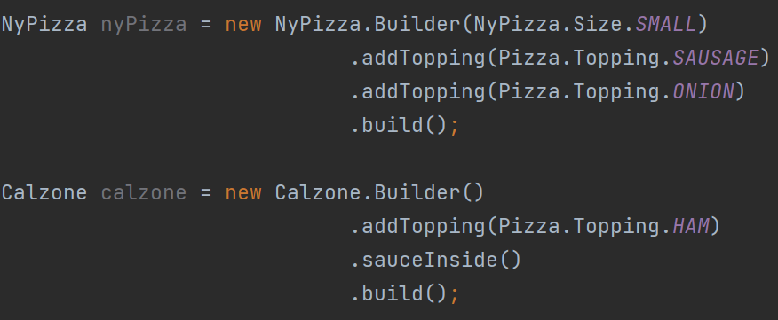
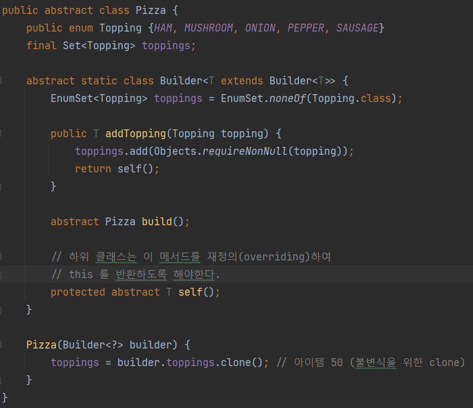
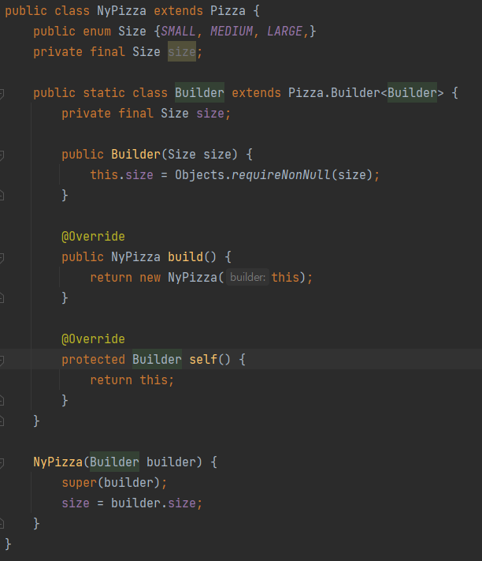
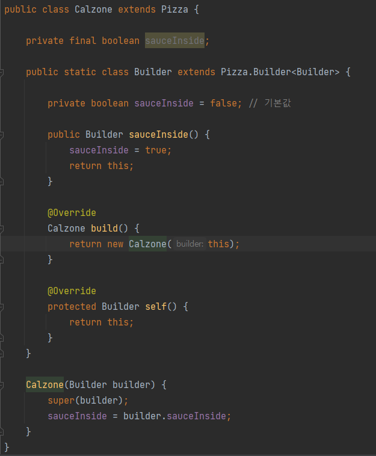

# Builder

> 앞서 배웠던 정적 팩토리 메서드에서 더 발전시켜 builder패턴을 배워보고자 한다.

기본적으로 Builder 패턴은 생성자를 코드로 작성한다는 점에서 많은 편리함을 제공해주지만,

```java
public class NutritionFacts {
    private final int servingSize; // 1회 제공량  *필수
    private final int servings;	   // N 회제공량  *필수
    private final int calories;    // 칼로리       선택
    private final int fat;         // 지방         선택
    private final int sodium;      // 염분         선택
    
    public NutritionFacts(int servingSize, int servings) {
        this(servingSize, servings, 0);
    }
    
    public NutritionFacts(int servingSize, int servings, int calories) {
        this(servingSize, servings, calories, 0);
    }
}
```

​	다음 코드를 보면 영양 성분에 대한 `필수` 조건과 `선택` 조건이 명시되어있고 그에 따른 생성자들이 여러개 있는 상황이다. 사실 해당 class는 총 5개의 property를 가지고 있지만, 더 많은 property를 가지고 있는 class라면 생성자를 그 때 그때마다 만들어주는 것이 굉장히 비효율적일 것이다.

따라서, 등장한 것이 `Builder` 패턴이다.

```java
public class NutritionFacts {
    private final int servingSize; // 1회 제공량  *필수
    private final int servings;	   // N 회제공량  *필수
    private final int calories;    // 칼로리       선택
    private final int fat;         // 지방         선택
    private final int sodium;      // 염분         선택
    
    public static class Builder {
        // 필수 매개변수
        private final int servingSize;
        private final int servings;
        
        // 선택 매개변수 - 기본값으로 초기화
        private int calories = 0;
        private int fat = 0;
        private int sodium = 0;
        
        public Builder(int servingSize, int servings) {
            this.servingSize = servingSize;
            this.servings = servings;
        }
        // ... 추가적인 요소들은 Builder로 모두 작성
    }
}
```

​	

위 코드처럼 작성하게 된다면 매우 큰 이점을 가져올 수 있다.

```java
// 기존 생성자 패턴
NutritionFacts cocaCola = new NutritionFacts(240, 8, 100, 0, 35, 27);

// Builder패턴을 적용한 코드
NutritionFacts cocaCola = new NutritionFacts.Builder(240, 8)
    						.calories(100)
    						.sodium(35)
    						.build();
```

 너무나 명확하게 장점을 볼 수 있다.

- 필수인자의 입력을 **강제**할 수 있고
- 선택값들은 따로 설정하지 않아도 초기화 가능
- 내가 원하는 값들이 어떤 값들인지 순서보장 없이도 작성가능
- 객체 생성 **불변성**을 보장
- `계층적으로 설계된 클래스와 함께 쓰기 좋다`


## 계층적으로 설계된 클래스







