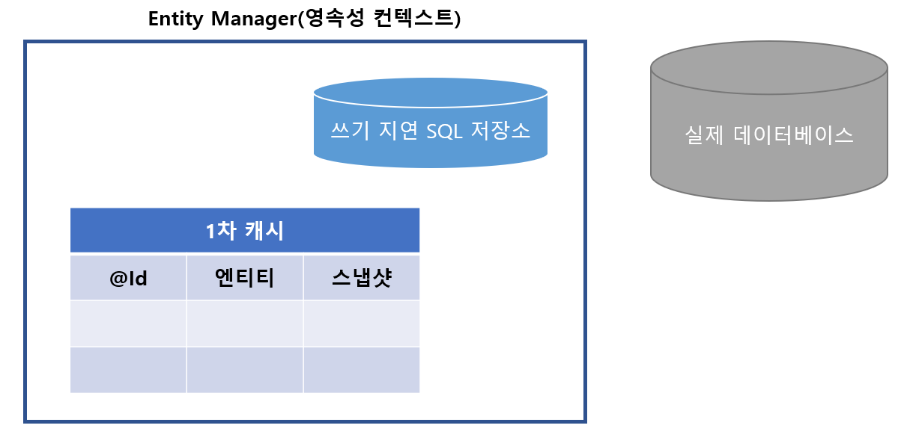

# EntityManager  ( 영속성컨텍스트 ) 에 대하여

> JPA를 사용하다보면 가장 먼저 만나는 부분이다.
>
> ```java
> // EntityManager(영속성 컨텍스트) 만드는 법
> EntityManager em = new EntityManager();
> ```
>
> 가장 처음 김영한님의 JPA강의를 들을 때, 기존 SQL Mapper를 사용하는 Mybatis는 결국 모든 조회, 삽입, 수정 로직을 SQL문으로 작성해야했다 ....
>
> 하지만 JPA를 사용했을때, 그저 `em.persist() ` ... 정말 놀라웠습니다 .. 따라서 이러한 EntityManager가 어떻게 동작하는지 알아보도록 하겠습니다!


## 개요

먼저 EntityManager를 다루기 전에, `EntityFactory`에 대해 알아보겠습니다!

이름에서도 유추하실 수 있듯이, `EntityFactory` 란 EnntityManager를 만들어내는 일련의 공장같은 것입니다.

아무래도 공장을 만드는 것이, 한 명의 일꾼을 만들어 내는 것보다 비용이 많이 들겠죠 ? 

EntityFactory도 EntityManager를 만드는 것보다 더 많은 비용을 요구한다고 합니다. 그에 반에 EntityManager는 거의 없다고하네요 ..!

그럼, `EntityManager`에는 **어떤 구성요소**와, **어떤 기능**을 제공하는지 한 번 알아보겠습니다.


## 구성요소

`EntityManager`는 결국 애플리케이션과 데이터베이스 사이에서 객체를 보관하는 가상 데이터베이스 같은 역할을 합니다.

가상 데이터베이스에 존재하는 구성요소는 총 **2 가지** 입니다.

- 1차 캐시
- 쓰기 지연 SQL 저장소


### 1차 캐시 ( 동일성 보장 )

1차 캐시가 있으므로, 사실 JPA에서 동일성이 보장됩니다.  <u>동일성(identity) 와 동등성(identity) 에 대해선 다음에 다뤄보겠습니다..!</u>

하나의 예시를 한 번 들어보겠습니다!

```java
String memberId = "100";
Member member1 = memberDAO.getMember(memberId);
Member member2 = memberDAO.getMember(memberId);

member1 == member2; // 결과 false
```

동일성(identity) 비교란, 객체의 주소값을 비교하는 것인데

SQL Mapper를 이용해 조회를 했을 때, 

`member1` , `member2` 를 구성하는 값은 같을 수 있으나, 실제로 참조하는 주소는 다릅니다. 


이 문제를 해결하기 위해, JPA는 `1차 캐시 테이블`을 하나 만듭니다. 

아래 그림은 EntityManager의 구성요소 입니다.



#### 구성 요소는 총 3가지로 아래와 같습니다.

- @Id
- 엔티티
- 스냅샷

| 구성요소 | 역할 |
| :------: | :--: |
|          |      |
|          |      |
|          |      |

