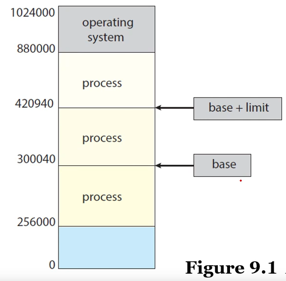
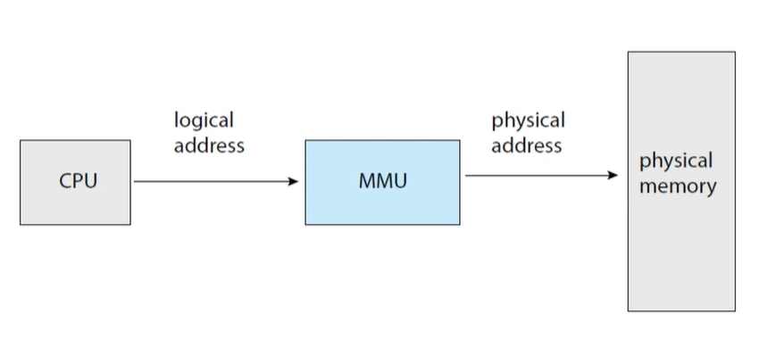

# Main Memory

> 그동안은 Process에 관련된 것을 배웠다면 이제는 어떻게 Memory에 적재되고 효과적으로 사용되는지 에 대해 알아볼 것이다.
>
> 즉, CPU가 각각의 Process의 PC를 어떻게 효율적으로 처리했는지를 알아봤다면,
>
> 이제는 각각의 Process가 어떻게 Multi Processing을 할 수 있게 Memory를 사용하는지에 대해 알아본다.

1. 메모리공간

   - 각각의 Process 들은 나눠진 Memory 공간을 갖고있어야한다.

   - 한 쌍의 register : `base register`  + `limit register` , 

     ​							두 쌍의 register는 실질적인 주소의 범위를 나타내준다.

### CPU가 해당하는 논리적주소 ( Logical Address ) 와 실질적 주소 ( Physical Address ) 가 있는데 

### 이 두 개의 주소의 차이는 다음과 같다.

|                 |      논리적 주소      |      물리적 주소       |
| :-------------: | :-------------------: | :--------------------: |
|      기본       |   CPU가 생성한 주소   | 메모리내의 실질적 주소 |
|    주소공간     | CPU가 생성한 모든공간 | 실제로 매핑된 주소공간 |
| 사용자 접근가능 |           O           |           X            |

> **정리** 
>
> > 논리적 주소는 CPU가 생성하고 사용자가 볼 수 있음
> >
> > 물리적 주소는 실제 Memory에 해당하는 주소이기에 사용자가 볼 수 없고 매번 바뀌지 않음

---

***그렇다면 과연 논리적 주소와 물리적 주소간의 관계는 어떻게 형성될까 ?***

### `Address Binding`  을 통해 이뤄진다.

## Address Binding 

- 먼저 모든 File들은 실행되기 전까지, Memory에 올라가기 전까지는 모두 Disk에 `Binary File`로 올라가 있을 것이다.

  따라서 이 Binary File을 메모리에 올렸을 때, `Process`가 된다.

- 실질적인 주소는 `O/S Kernel`  이 결정해주므로 정확한 주소는 알지 못한다.

  따라서, `Linker`, `Loader`  가 실질적인 주소로 Binding 해준다.

## MMU ( Memory Management Unit )

- HardWare 장치인데 ` Logical to Physical` 역할을 해주는 장치

 

### Dynamic Loading 

- 모든 실행되는 파일의 전부를 Memory에 올릴 순 없을 것이다. 예를들어, Memory의 크기는 16GB라고 했을 때, 실행중인 프로그램이 그 크기를 넘어간다면 굉장히 손해.

  따라서, 모든 routine을 한꺼번에 load 하지말고 필요할 때만 load 하자.

  

  

### Dynamic Linking , Shared Libraries

- `DLLs` : Dynamically Linked Libraries
  - 어떠한 실행 파일이 있을 떄, 우리가 흔히 사용할 수 있는 `print` 함수를 사용하기위해 관련 라이브러리를 가져와서 실행시키는 것이 아닌 `system library link` 를 통해 라이브러리를 가져오지 않고도 사용할 수 있게끔 하는것
- Static Linking
  - **메모리에 Load 할때** 함께 같이 올리는 것을 의미
- Dynamic Linking
  - 메모리에 Load한 이후에 Link를 최대한 필요할때 까지 연기시키는 방법 

## Contiguous Memory Allocation

- Main Memory를 가장 효율적으로 할당해야 할 것이다.
  1. First-fit
     - 100
     - 15 25 120 110 75
  2. Best-fit
  3. Worst-fit

## Fragmentation

- CMA ( External Fragmentation )

- Segmentation 

- Pagination ( Internal Fragmentation )

### 외부단편화란 ?

- 가변적인 메모리의 할당, 해제할 때 발생하는 문제

### 내부단편화란 ?

- Paging 기법을 사용했을 때, 발생하는 문제

### 내부 단편화를 해결하기 위해 어떤 방법이 있을까 ?

- Page의 크기를 줄이면 어느정도 해결할 순 있지만, 페이지 테이블의 크기가 커지므로 완벽히 해결할 순 없다고 생각.

