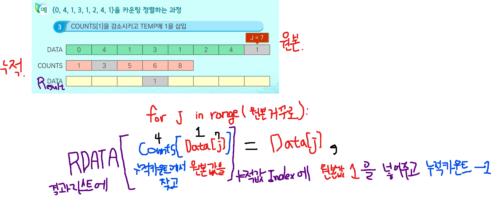

# Sorting

> 버블정렬 (Bubble Sort)
>
> 카운팅정렬 (Counting Sort)
>
> 선택정렬 (Selection Sort)

---


### 1. 버블정렬 ( Bubble Sort )

**버블정렬**은 인접한 두 개의 원소를 비교하며 자리를 계속 교환하는 방식

- 과정

1. 첫 번째 원소부터 인접한 원소끼리 계속 자리를 교환하면서 맨 마지막 자리까지 이동
2. 한 단계가 끝나면 가장 큰 원소 또는 가장 작은 원소가 마지막 자리로 정렬됨


- 시간복잡도
  - O(n^2)


- 코드

```python
A = [55, 7, 78, 12, 42]

def Bubble_sort(a): # 정렬할 리스트
    for i in range(len(a)-1, 0, -1): # 범위의 끝위치부터
        for j in range(0, i):
            if a[j] > a[j+1]:
                a[j], a[j+1] = a[j+1], a[j]
```


### 2. 카운팅정렬 ( Counting Sort )

**카운팅정렬**은 항목들의 순서를 결정하기 위해 집합에 각 항목이 몇 개씩 있는지 세는 작업을 하여,

선형 시간에 정렬하는 효율적인 알고리즘 


*주의할점* 

> 정수나 정수로 표현할 수 있는 자료에 대해서만 적용가능
>
> 각 항목의 발생 횟수를 기록하기 위해, 정수 항목으로 인덱스되는 카운트들의 리스트를 사용하기때문
>
> 카운트들을 위한 충분한 공간을 할당하려면 집합 내의 가장 큰 정수를 알아야함


- 시간복잡도 
  - O(n+k) : n 은 리스트의 개수, k는 정수의 최대값


- 구현

```python

def Counting_sort(A, B, k): # 정렬할 리스트
    # A는 입력리스트
    # B는 정렬된 리스트
    # C는 카운트 리스트
    
    C = [0] * k
    
    for i in range(0, len(B)):
        C[A[i]] += 1
    
    for i in range(1, len(C)):
        C[i] += C[i-1]
    
    for i in range(len(B)-1, -1, -1):
        B[C[A[i]]-1] = A[i]
        C[A[i]] -= 1
        
```

